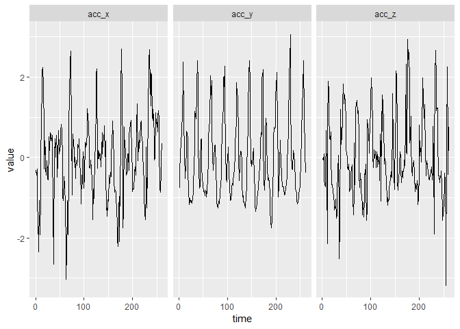

<!-- README.md is generated from README.Rmd. Please edit that file -->

# Google Cloud Platform NEXT 2018: Tools for working with TensorFlow in R

## About the data

Activity Recognition from Single Chest-Mounted Accelerometer Data Set

[Source
data](https://archive.ics.uci.edu/ml/datasets/Activity+Recognition+from+Single+Chest-Mounted+Accelerometer)

### Source:

Uncalibrated Accelerometer Data are collected from 15 participantes
performing 7 activities. The dataset provides challenges for
identification and authentication of people using motion patterns.

### Data Set Information:

  - The dataset collects data from a wearable accelerometer mounted on
    the chest
  - Sampling frequency of the accelerometer: 52 Hz
  - Accelerometer Data are Uncalibrated
  - Number of Participants: 15
  - Number of Activities: 7
  - Data Format: CSV

### Attribute Information:

  - Data are separated by participant
  - Each file contains the following information
      - sequential number
      - x acceleration
      - y acceleration
      - z acceleration
      - label
  - Labels are codified by numbers 1: Working at Computer 2: Standing
    Up, Walking and Going updown stairs 3: Standing 4: Walking 5: Going
    UpDown Stairs 6: Walking and Talking with Someone 7: Talking while
    Standing

## Data preparation

The data was pre-processed by Mango Solutions for their [keras
workshop](http://github.com/mangothecat/keras-workshop) at eRum 2018:

  - The raw data is in long format with a running label on person ID and
    activity ID.
  - We broke it into overlapping chunks and filtered for walking-only
    chunks of 5 seconds.
  - We did some center-scaling but only within chunks

<!-- end list -->

``` r
library(ggplot2)
#> Warning: package 'ggplot2' was built under R version 3.5.1
library(tidyr)
x_walk <- readRDS("data/x_walk.rds")
x_walk$train[1, 1:5, ]
#>           acc_x      acc_y       acc_z
#> [1,] -0.3195554 -0.7566914 -0.03613472
#> [2,] -0.4358387 -0.3765424 -0.06066481
#> [3,] -0.2904846  0.0669647  0.08651576
#> [4,] -0.9591135  0.3964272 -0.55126669
#> [5,] -1.7149549  0.5991733 -0.67391716
frame <- as.data.frame(x_walk$train[1, , ])
frame$time <- 1:260
tidy_frame <- gather(frame, acc, value, -time)
str(tidy_frame)
#> 'data.frame':    780 obs. of  3 variables:
#>  $ time : int  1 2 3 4 5 6 7 8 9 10 ...
#>  $ acc  : chr  "acc_x" "acc_x" "acc_x" "acc_x" ...
#>  $ value: num  -0.32 -0.436 -0.29 -0.959 -1.715 ...
ggplot(tidy_frame, aes(time, value)) + geom_line() + facet_grid(~acc)
```

<!-- -->
